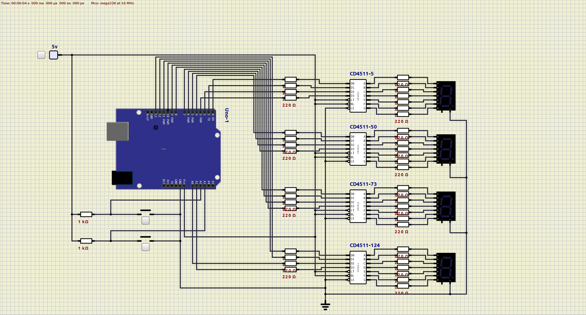

# Arduino Pomodoro Timer Using A BCD to 7-segments Converter and 4 7-segment Displays
This project consists of two parts, a programmed part that is the functionality of the timer itself and the electronic part that is in charge of transforming the binary output of the program into something that can be seen.

The timer is a simple representation of a Pomodoro timer which will be counting working lapses of 25 minutes with 5 minutes of break. This will be done by alternating these durations with the action of the Stop button. So, this means that if the timer is running for the first time it will be showing the 25 minutes countdown ready to be started. Then, when that countdown ends (or is stopped by the user) the timer will show the 5 minutes countdown ready to be started. After finishing the 5 minutes countdown it will return to the 25 minutes and the cycle will continue.

For the display circuit, the CD4511 converter (which is used to control a 7-segment display) is used to represent each digit of the countdown. Here is a list of the materials:

- 1 - Arduino Uno Rev3
- 2 - 1K resistors
- 44 - 220Oms resistors
- 4 - CD5411 IC
- 4 - 7-segments displays
- 2 - Buttons (NO)
- 1 - 5v external power source

Here is a schematic diagram for your connection:

Find the simulation file for using in the [SimulIDE](https://simulide.gumroad.com/) on the `simulation` folder.

Note: The simulation needs to load the generated `.hex` file from the Arduino build process. So, if the simulation is not finding it, you just need to load the program on a Arduino IDE instance and build it for Arduino Uno.