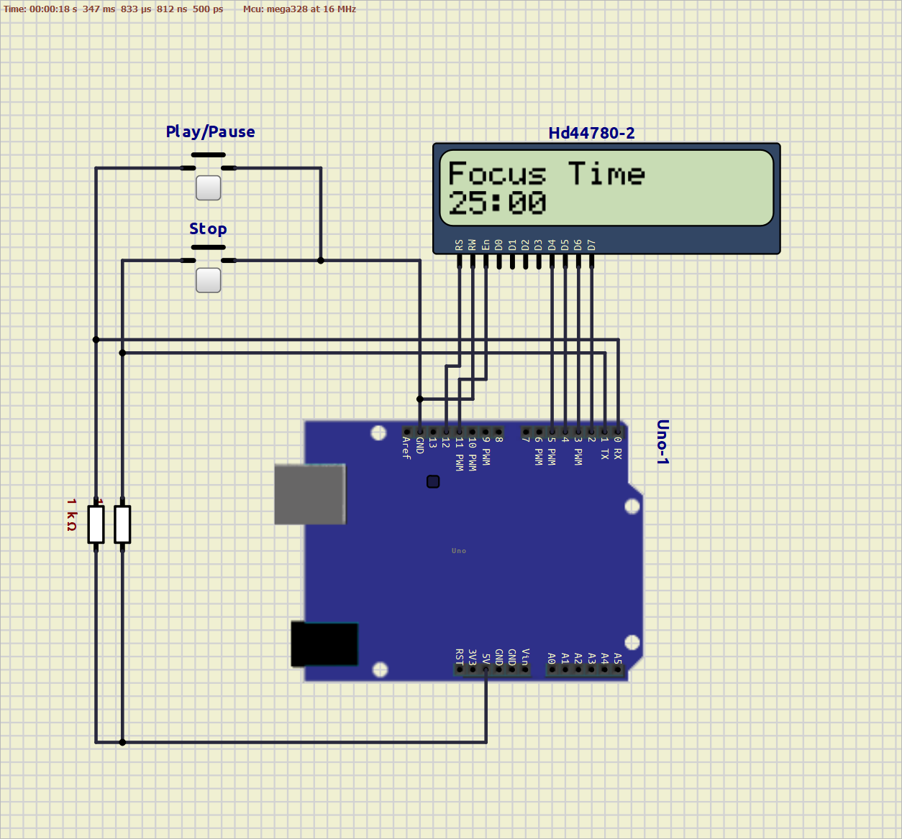

# Arduino Pomodoro Timer Using An LCD Display
This projects generates a pomodoro timer using an LCD display and a Arduino Uno to control it and show the countdowns.

The timer is a simple representation of a Pomodoro timer which will be counting working lapses of 25 minutes with 5 minutes of break. This will be done by alternating these durations with the action of the Stop button. So, this means that if the timer is running for the first time it will be showing the 25 minutes countdown ready to be started. Then, when that countdown ends (or is stopped by the user) the timer will show the 5 minutes countdown ready to be started. After finishing the 5 minutes countdown it will return to the 25 minutes and the cycle will continue.

For the display circuit, the CD4511 converter (which is used to control a 7-segment display) is used to represent each digit of the countdown. Here is a list of the materials:

- 1 - Arduino Uno Rev3
- 2 - 1K resistors
- 2 - Buttons (NO)

Here is a schematic diagram for your connection:

Find the simulation file for using in the [SimulIDE](https://simulide.gumroad.com/) on the `simulation` folder.